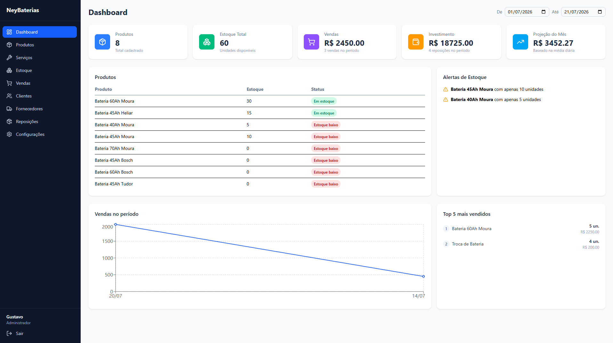
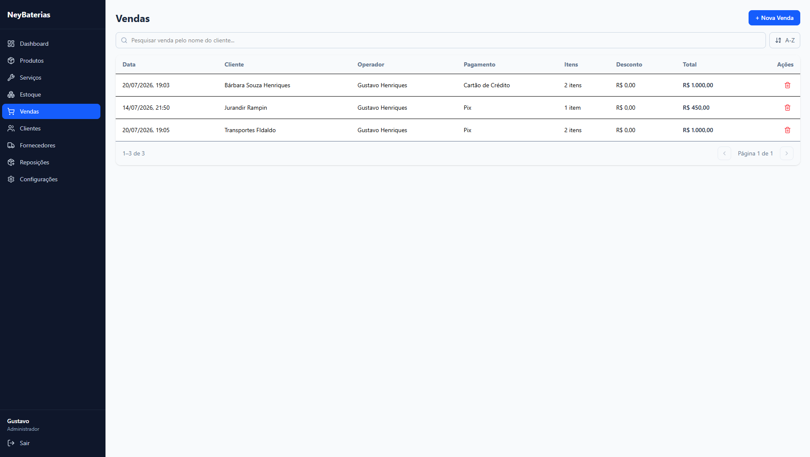
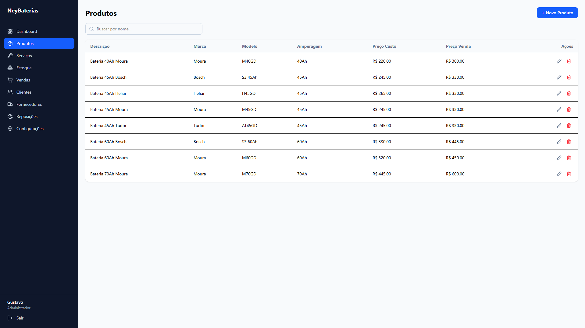
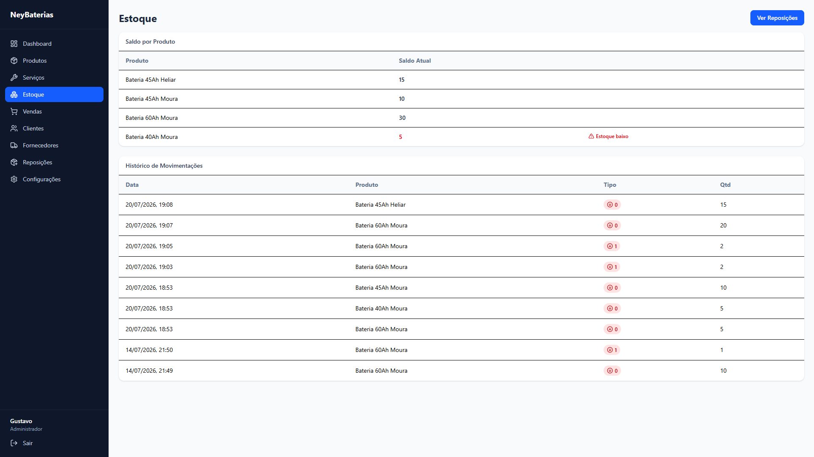
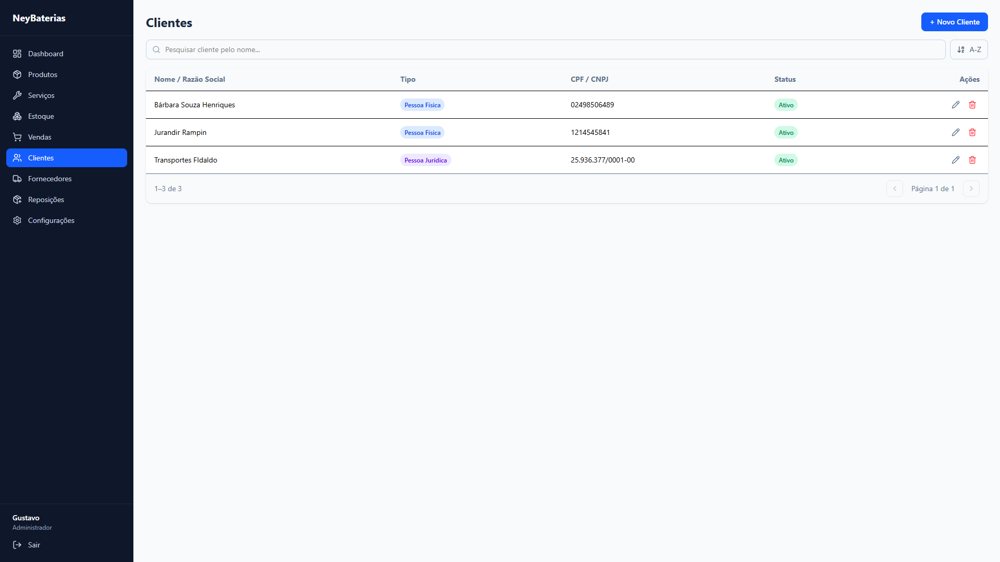
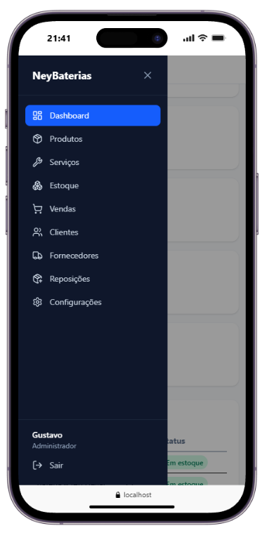
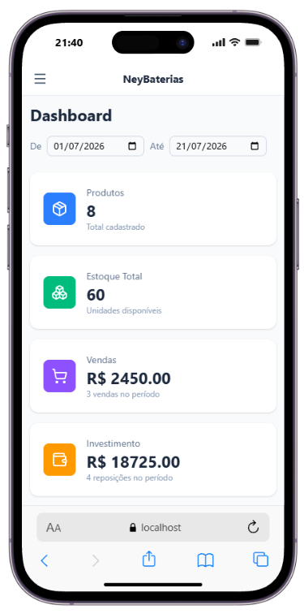
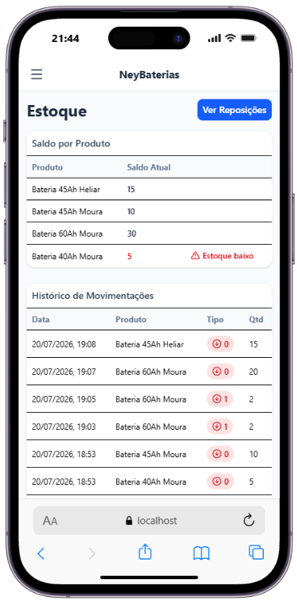
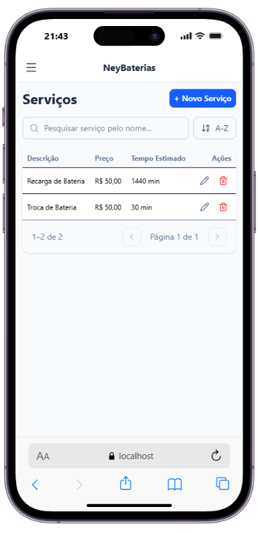
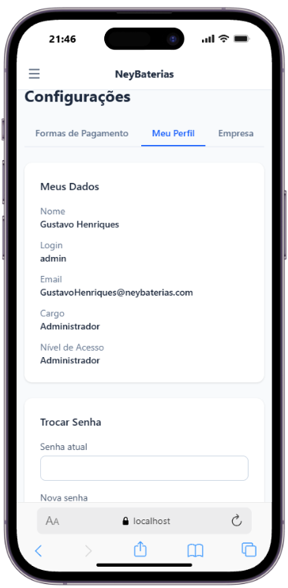

# NeyBaterias

Sistema de gestão para loja de baterias automotivas — controle de clientes, produtos, serviços, estoque, vendas, reposições e fornecedores, com dashboard de indicadores em tempo real.

Desenvolvido com **.NET 10** (Web API) no backend e **React + Vite** no frontend, seguindo os princípios de **Clean Architecture**.



## Índice

- [Funcionalidades](#funcionalidades)
- [Screenshots](#screenshots)
- [Arquitetura](#arquitetura)
- [Tecnologias](#tecnologias)
- [Como rodar localmente](#como-rodar-localmente)
- [Deploy](#deploy)
- [Níveis de acesso](#níveis-de-acesso)

## Funcionalidades

- **Dashboard** com indicadores reais: total de produtos, estoque disponível, vendas no período, investimento em reposições, projeção mensal, gráfico de vendas, alertas de estoque baixo e ranking de mais vendidos.
- **Clientes** — cadastro de Pessoa Física e Jurídica, com edição, inativação e exclusão.
- **Produtos e Serviços** — CRUD completo, com edição inline.
- **Estoque** — saldo por produto e histórico completo de movimentações (entradas e saídas).
- **Vendas** — registro de venda com múltiplos itens (produtos e/ou serviços), baixa automática de estoque e cálculo de total/desconto.
- **Reposições de Estoque** — registro de compras de fornecedores com entrada automática no estoque.
- **Fornecedores** — CRUD completo.
- **Autenticação** — login com JWT, sessão expira automaticamente após 8h.
- **4 níveis de acesso** (Leitura / Leitura+Cadastro / +Atualizar e Excluir / Administrador), controlando o que cada operador pode ver e fazer, tanto na API quanto na interface.
- **Totalmente responsivo** — menu lateral vira gaveta deslizante em telas pequenas, com tabelas e formulários adaptados para mobile.

## Screenshots

### Desktop

| Dashboard | Vendas |
|---|---|
|  |  |

| Produtos | Estoque |
|---|---|
|  |  |

| Clientes |
|---|
|  |

### Mobile

<p>
  
  
  
  
  
</p>

## Arquitetura

O backend segue **Clean Architecture**, separado em 4 projetos independentes:

```
src/
├── NeyBaterias.Domain          # Entidades e enums — sem dependências externas
├── NeyBaterias.Application     # Regras de negócio, DTOs e interfaces (services)
├── NeyBaterias.Infrastructure  # EF Core, repositórios, Unit of Work, migrations
└── NeyBaterias.API             # Controllers, autenticação, configuração da API
```

Principais padrões utilizados:

- **Repository Pattern** + **Unit of Work** para acesso a dados
- **DTOs** em todos os endpoints (nunca expõe entidades diretamente)
- **Policy-based Authorization** para os 4 níveis de acesso
- **Dependency Injection** nativo do ASP.NET Core

O frontend é organizado por página/funcionalidade, com uma camada de serviço (`services/api.js`) centralizando toda comunicação com a API, e hooks customizados para lógica reutilizável (busca, ordenação e paginação de listas).

## Tecnologias

**Backend**
- .NET 10 / ASP.NET Core Web API
- Entity Framework Core (Npgsql / PostgreSQL)
- JWT Bearer Authentication
- BCrypt.Net (hash de senhas)
- Swagger / OpenAPI

**Frontend**
- React 19 + Vite
- React Router
- Tailwind CSS 4
- Recharts (gráficos do dashboard)
- Lucide React (ícones)

**Infraestrutura**
- PostgreSQL (Neon)
- Deploy do backend via Docker (Render)
- Deploy do frontend (Vercel)

## Como rodar localmente

### Backend

```bash
cd src/NeyBaterias.API
dotnet restore
dotnet ef database update --project ../NeyBaterias.Infrastructure --startup-project .
dotnet run
```

A API sobe em `http://localhost:5001` (Swagger em `/swagger`).

### Frontend

```bash
cd frontend
npm install
npm run dev
```

Configure a variável de ambiente `VITE_API_URL` apontando para a API (`.env` na pasta `frontend`).

## Deploy

- **Backend**: Docker, hospedado no Render.
- **Banco de dados**: PostgreSQL gerenciado pelo Neon.
- **Frontend**: build estático (Vite) hospedado no Vercel.

## Níveis de acesso

| Nível | Permissões |
|---|---|
| 1 | Ler |
| 2 | Ler, Cadastrar |
| 3 | Ler, Cadastrar, Atualizar, Excluir |
| 4 | Tudo do nível 3 + gestão de operadores, senhas e configurações da empresa (Administrador) |

---

Projeto desenvolvido por [Gustavo Henriques](https://github.com/GustavoHenriques99).
